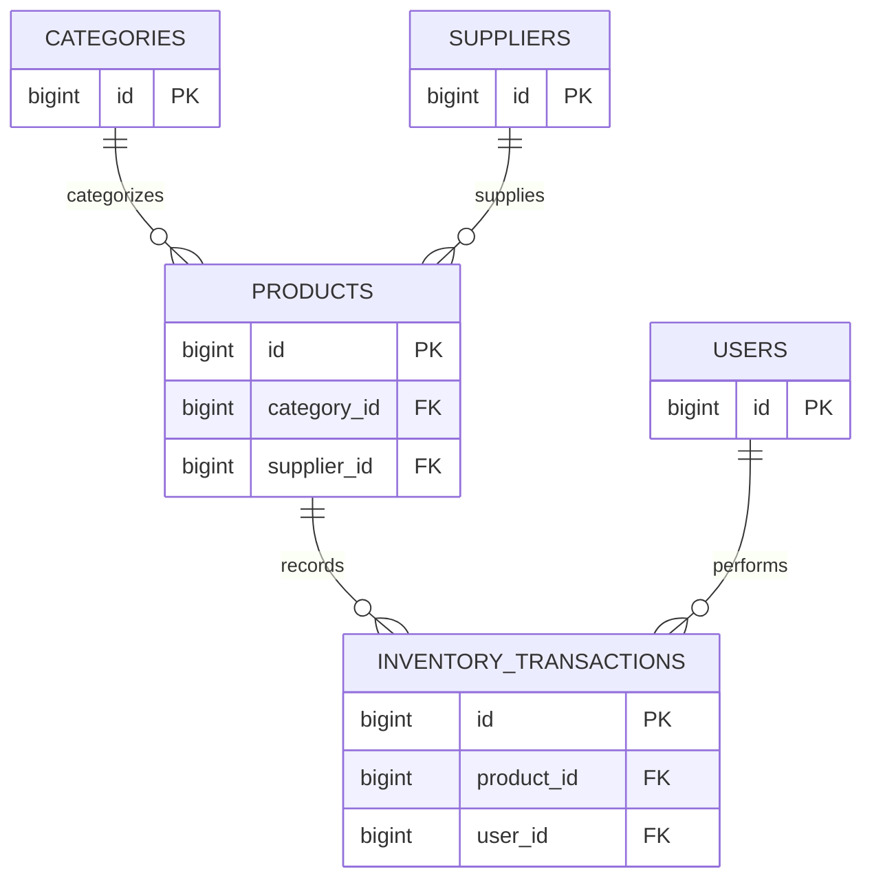

# 📄 Entity Relationship Diagram (ERD)

> **Version:** 1.0  
> **Status:** Final  
> **Document Type:** Entity Relationship Diagram (ERD)  
> **Project:** Pharmora  
> **Prepared by:** Astrella Syadira Ramadhante  
> **Last Updated:** July 2026

---

# Table of Contents

- [1. Purpose](#1-purpose)
- [2. Entity Relationship Diagram](#2-entity-relationship-diagram)
- [3. Relationship Summary](#3-relationship-summary)
- [4. Relationship Explanation](#4-relationship-explanation)
- [5. Design Notes](#5-design-notes)
- [6. Closing](#6-closing)

---

# 1. Purpose

This document provides a visual representation of the database structure used by Pharmora.

Its primary purpose is to illustrate how business entities are connected through relational database relationships while maintaining consistency with the project's Database Design document.

The Entity Relationship Diagram (ERD) serves as a blueprint for implementing Laravel migrations, Eloquent relationships, database constraints, and future database enhancements.

Rather than introducing new business rules, this document visualizes the relationships that have already been defined throughout the project documentation, ensuring a shared understanding of the application's data model.

The ERD supports the following objectives:

- Visualize the relationships between business entities.
- Improve understanding of the overall database structure.
- Serve as a reference for Laravel migration development.
- Support the implementation of Eloquent model relationships.
- Assist future maintenance and database expansion.

The diagram presented in this document represents the MVP scope of Pharmora and includes only the entities required to support the current inventory management features.

Future versions of the application may extend this diagram with additional entities while preserving the architectural principles established in the Database Design document.

---

# 2. Entity Relationship Diagram

The following Entity Relationship Diagram illustrates the logical relationships between all database entities within the MVP scope of Pharmora.

The diagram focuses on entity relationships rather than detailed table attributes.

Detailed column definitions, data types, and constraints are documented separately in the **Data Dictionary**.



The diagram represents the complete relational structure of the MVP database and serves as the primary reference for database implementation.

---

# 3. Relationship Summary

The following table summarizes all relationships between entities in the Pharmora database.

| Parent Entity | Child Entity | Relationship | Foreign Key |
|---------------|-------------|--------------|-------------|
| Categories | Products | One-to-Many (1:N) | `category_id` |
| Suppliers | Products | One-to-Many (1:N) | `supplier_id` |
| Products | Inventory Transactions | One-to-Many (1:N) | `product_id` |
| Users | Inventory Transactions | One-to-Many (1:N) | `user_id` |

---

## Cardinality Overview

The MVP database consists exclusively of **One-to-Many (1:N)** relationships.

```
Category
1 ────────────────< N Products

Supplier
1 ────────────────< N Products

Product
1 ────────────────< N Inventory Transactions

User
1 ────────────────< N Inventory Transactions
```

No Many-to-Many (M:N) or One-to-One (1:1) relationships are required within the current MVP scope.

This simplified relational model improves maintainability while fully supporting the operational requirements defined in the Product Requirement Document.

---

# 4. Relationship Explanation

This section explains the purpose of each relationship represented in the Entity Relationship Diagram.

---

## Categories → Products

Relationship Type:

**One-to-Many (1:N)**

A single category can contain multiple products, while each product belongs to exactly one category.

This relationship organizes inventory into logical classifications, improving data organization, searchability, and reporting.

Foreign Key:

```
category_id
```

---

## Suppliers → Products

Relationship Type:

**One-to-Many (1:N)**

A supplier may provide multiple products, while each product references one supplier.

This relationship centralizes supplier information and improves traceability during inventory procurement.

Foreign Key:

```
supplier_id
```

---

## Products → Inventory Transactions

Relationship Type:

**One-to-Many (1:N)**

Each product can have many inventory transactions throughout its lifecycle.

Every Stock In and Stock Out activity generates a new inventory transaction record linked to the corresponding product.

This relationship enables inventory history tracking without modifying historical transaction data.

Foreign Key:

```
product_id
```

---

## Users → Inventory Transactions

Relationship Type:

**One-to-Many (1:N)**

Each inventory transaction records the administrator responsible for performing the operation.

One administrator may create multiple inventory transactions over time.

This relationship improves accountability, traceability, and supports future auditing requirements.

Foreign Key:

```
user_id
```

---

# 5. Design Notes

The Entity Relationship Diagram has been intentionally designed to remain simple, consistent, and aligned with the MVP scope of Pharmora.

Several architectural decisions were made during the database design process.

## Centralized Inventory Transactions

All inventory movements are stored within a single `inventory_transactions` table.

Instead of separating Stock In and Stock Out into different tables, the transaction type determines the nature of each inventory movement.

This approach reduces structural complexity while providing greater flexibility for future transaction types.

---

## Normalized Database Structure

Business entities are stored independently to minimize data redundancy.

Each entity has a clearly defined responsibility and communicates with other entities through foreign key relationships.

This design improves maintainability and supports future database expansion.

---

## Clear Separation of Master and Transactional Data

Master data consists of relatively static business information:

- Users
- Categories
- Suppliers
- Products

Transactional data records operational activities:

- Inventory Transactions

Separating these responsibilities simplifies maintenance and reduces unintended data dependencies.

---

## Laravel Convention Compliance

The database structure follows Laravel naming conventions for:

- Table names
- Primary keys
- Foreign keys
- Timestamps
- Relationship naming

Following framework conventions minimizes custom configuration and improves development efficiency.

---

## MVP-Oriented Architecture

The ERD intentionally excludes entities that are outside the current project scope.

Examples include:

- Purchase Orders
- Warehouses
- Customers
- Sales
- Reports

These modules may be introduced in future versions without requiring major changes to the existing relational structure.

---

# 6. Closing

This Entity Relationship Diagram provides a visual representation of the relational database model that supports Pharmora's inventory management system.

Together with the Database Design document, the ERD establishes a consistent foundation for implementing Laravel migrations, Eloquent models, foreign key constraints, and application logic.

The Data Dictionary complements this document by providing detailed definitions for database fields, constraints, and data types.

Future database enhancements should maintain the architectural principles established throughout this documentation to ensure consistency, maintainability, and long-term scalability.

This document should be reviewed whenever new entities or relationships are introduced into the system.