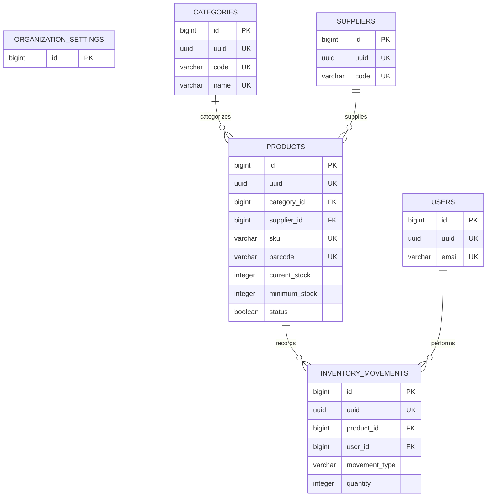

# 📄 Entity Relationship Diagram (ERD)

> **Version:** 2.0  
> **Status:** Approved & Frozen  
> **Document Type:** Entity Relationship Diagram (ERD)  
> **Project:** Pharmora  
> **Prepared by:** Astrella Syadira Ramadhante  
> **Last Updated:** July 2026

---

# Table of Contents

- [1. Purpose](#1-purpose)
- [2. Entity Relationship Diagram](#2-entity-relationship-diagram)
- [3. Relationship Summary](#3-relationship-summary)
- [4. Relationship Explanation](#4-relationship-explanation)
- [5. Design Notes](#5-design-notes)
- [6. Closing](#6-closing)

---

# 1. Purpose

This document provides the official Entity Relationship Diagram (ERD) for the Pharmora database.

Its primary purpose is to illustrate how business entities are connected through relational database relationships while maintaining consistency with the project's Database Design, Data Dictionary, Architecture Decision Records (ADR), and Database Schema Freeze documentation.

The Entity Relationship Diagram serves as the primary blueprint for implementing Laravel migrations, Eloquent relationships, foreign key constraints, and future database enhancements.

Rather than introducing new business rules, this document visualizes the relationships that have already been approved throughout the database design process, ensuring a shared understanding of the application's relational model.

The ERD supports the following objectives:

- Visualize relationships between business entities.
- Validate the final database architecture.
- Serve as the primary reference for Laravel migration development.
- Support Eloquent relationship implementation.
- Improve database maintainability and future scalability.

The diagram presented in this document represents the finalized database schema for Pharmora MVP Version 1.0.

---

# 2. Entity Relationship Diagram

The following Entity Relationship Diagram illustrates the finalized relational database structure used by Pharmora.

The diagram focuses on entity relationships and essential implementation attributes.

Detailed column definitions, data types, indexes, constraints, and validation rules are documented separately in the **Data Dictionary**.



The diagram represents the complete relational structure of the Pharmora MVP database and serves as the official reference for Laravel implementation.

---

# 3. Relationship Summary

The following table summarizes all relationships between entities in the Pharmora database.

| Parent Entity | Child Entity | Relationship | Foreign Key |
|---------------|-------------|--------------|-------------|
| Categories | Products | One-to-Many (1:N) | `category_id` |
| Suppliers | Products | One-to-Many (1:N) | `supplier_id` |
| Products | Inventory Movements | One-to-Many (1:N) | `product_id` |
| Users | Inventory Movements | One-to-Many (1:N) | `user_id` |

**Organization Settings** is an independent configuration entity and intentionally does not participate in foreign key relationships within the MVP scope.

---

## Cardinality Overview

The Pharmora MVP database consists exclusively of **One-to-Many (1:N)** relationships.

```
Category
1 ────────────────< 0..N Products

Supplier
1 ────────────────< 0..N Products

Product
1 ────────────────< 0..N Inventory Movements

User
1 ────────────────< 0..N Inventory Movements
```

Participation Rules

| Parent Entity | Child Entity | Parent Participation | Child Participation |
|---------------|-------------|----------------------|---------------------|
| Category | Product | Optional | Mandatory |
| Supplier | Product | Optional | Mandatory |
| Product | Inventory Movement | Optional | Mandatory |
| User | Inventory Movement | Optional | Mandatory |

No Many-to-Many (M:N) or One-to-One (1:1) relationships are required within the current MVP scope.

---

# 4. Relationship Explanation

This section explains the purpose of each relationship represented in the Entity Relationship Diagram.

---

## Categories → Products

**Relationship Type**

One-to-Many (1:N)

A single category can classify multiple products, while every product belongs to exactly one category.

This relationship improves product organization, searching, filtering, and reporting.

**Foreign Key**

```
category_id
```

---

## Suppliers → Products

**Relationship Type**

One-to-Many (1:N)

A supplier may provide multiple products, while each product references one supplier.

This relationship centralizes supplier information and supports inventory procurement.

**Foreign Key**

```
supplier_id
```

---

## Products → Inventory Movements

**Relationship Type**

One-to-Many (1:N)

Each product may generate multiple inventory movement records throughout its lifecycle.

Inventory Movements store every stock-related activity, including Stock In, Stock Out, and future inventory adjustment operations.

Historical inventory records are never modified after creation.

**Foreign Key**

```
product_id
```

---

## Users → Inventory Movements

**Relationship Type**

One-to-Many (1:N)

Each inventory movement records the authenticated administrator responsible for performing the operation.

This relationship improves accountability, traceability, and future auditing capabilities.

**Foreign Key**

```
user_id
```

---

# 5. Design Notes

The Entity Relationship Diagram has been intentionally designed to remain simple, normalized, and aligned with the MVP scope of Pharmora.

Several architectural decisions were made during the database design process.

---

## Centralized Inventory Movements

All inventory activities are stored within a single **Inventory Movements** table.

Instead of separating Stock In, Stock Out, and Adjustment into different tables, the movement type determines the business operation.

This approach simplifies reporting, relationships, and future feature expansion.

---

## UUID Strategy

Business entities use UUIDs as public identifiers while retaining auto-increment primary keys for internal database relationships.

This strategy improves security, API compatibility, and public URL safety.

---

## Current Stock Strategy

Current inventory quantity is stored directly in the **Products** table.

Historical inventory activities are recorded separately within **Inventory Movements**.

This controlled denormalization significantly improves dashboard performance while preserving a complete inventory audit trail.

---

## Organization Settings

Organization Settings is implemented as an independent configuration entity.

Rather than duplicating organizational information across multiple tables, global configuration is centralized into a single table.

---

## Normalized Database Structure

Business entities are stored independently to minimize data redundancy.

The database satisfies:

- First Normal Form (1NF)
- Second Normal Form (2NF)
- Third Normal Form (3NF)

Only one controlled denormalization is applied for current inventory performance.

---

## Laravel Convention Compliance

The database follows Laravel naming conventions for:

- Table names
- Primary keys
- Foreign keys
- Relationship naming
- Soft Deletes
- Timestamp columns

Following Laravel conventions minimizes custom configuration and improves maintainability.

---

## MVP-Oriented Architecture

The ERD intentionally excludes entities outside the current project scope.

Examples include:

- Purchase Orders
- Warehouses
- Sales
- Customers
- Product Batches
- Expiration Tracking
- Multi-Branch Management

These modules may be introduced in future versions without requiring major changes to the existing relational structure.

---

# 6. Closing

This Entity Relationship Diagram represents the finalized relational database model supporting Pharmora's inventory management platform.

Together with the Database Design, Data Dictionary, Database Review documents, Architecture Decision Records, and Database Schema Freeze, the ERD establishes a consistent foundation for implementing Laravel migrations, Eloquent models, foreign key constraints, factories, seeders, and application logic.

This document represents the official database baseline for **Pharmora MVP Version 1.0**.

Any structural modifications introduced after this point should follow the project's Architecture Decision Record (ADR) process to maintain architectural consistency and long-term maintainability.